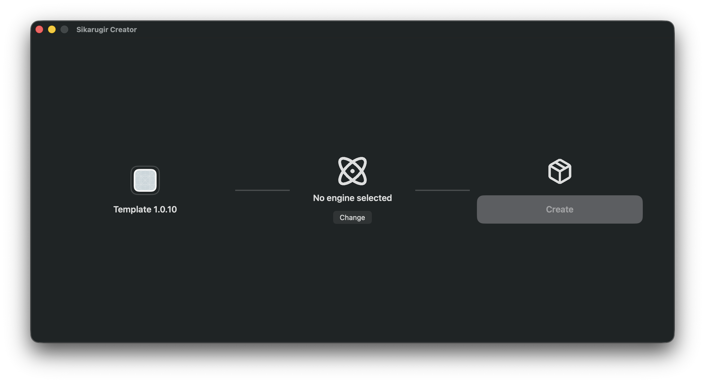
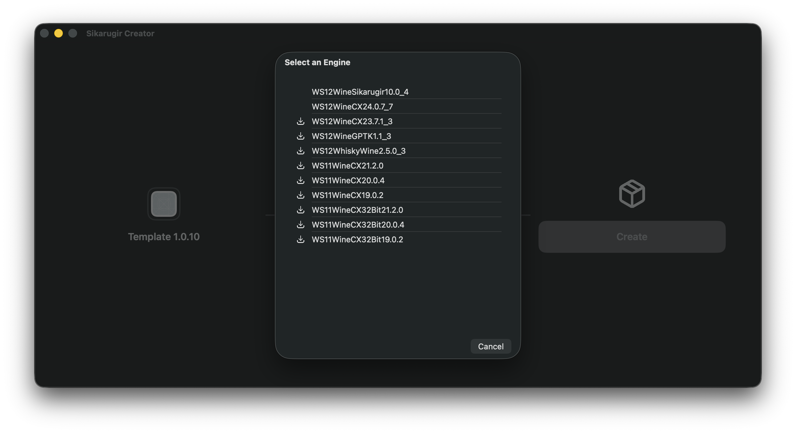

# Setup Carla on Mac (Apple Silicon)

Carla does not yet have native support for Mac (Apple Silicon), and Docker-based solutions are currently ineffective. This tutorial provides a workaround using **Wineskin (Wine)**.

### 1. Install Winery (Wineskin)

1. Download and install the latest version of Winery from [here](https://github.com/Sikarugir-App/Creator/releases).
   - Alternatively, if you have **Homebrew** installed, you can install it via the terminal:
   ```bash
   brew upgrade
   brew install --cask Sikarugir-App/sikarugir/sikarugir
   ```

2. **Rosetta 2** is required for Apple Silicon Macs. Install it by running:
   ```bash
   /usr/sbin/softwareupdate --install-rosetta --agree-to-license
   ```

### 2. Configure the Wrapper

3. Open the **Sikarugir Creator** app (usually found in `/Applications/Sikarugir Creator.app` or via Spotlight).
   
   

4. Install the latest engine and update the wrapper:
   - Click the **Change** button.
   - Select the engine: `WS12WineCX24.0.7_7`.
   
   

5. Create a new wrapper:
   - Click the **Create** button.
   - Name the new wrapper `Carla`.
   
   
