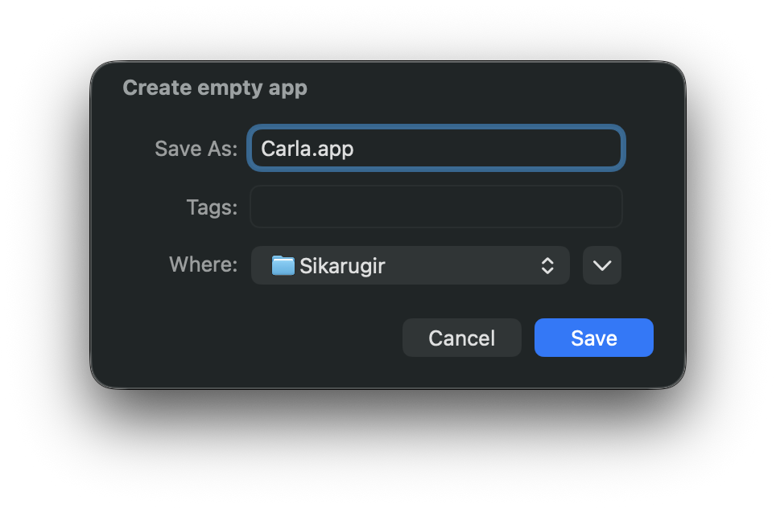
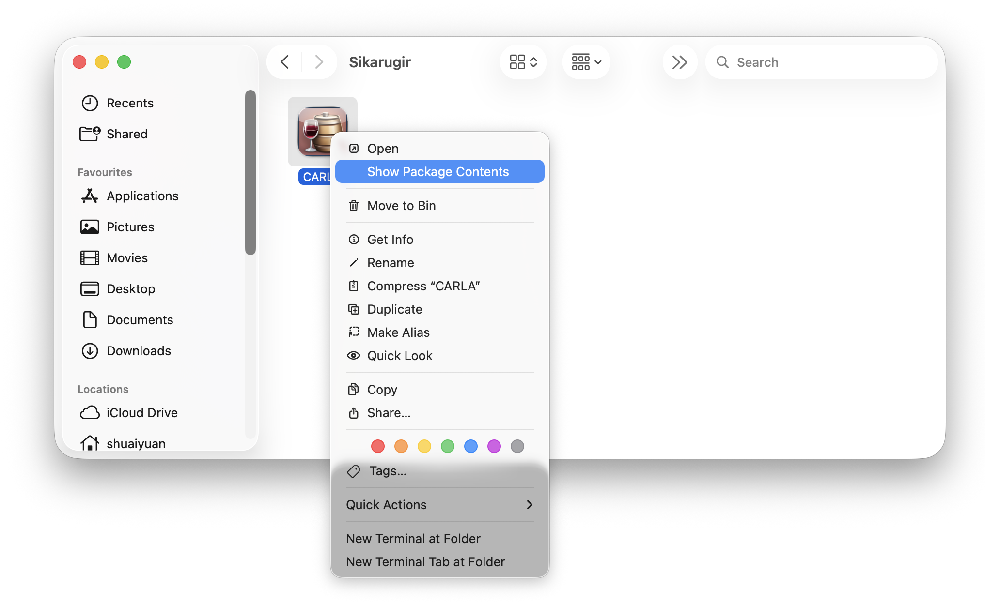
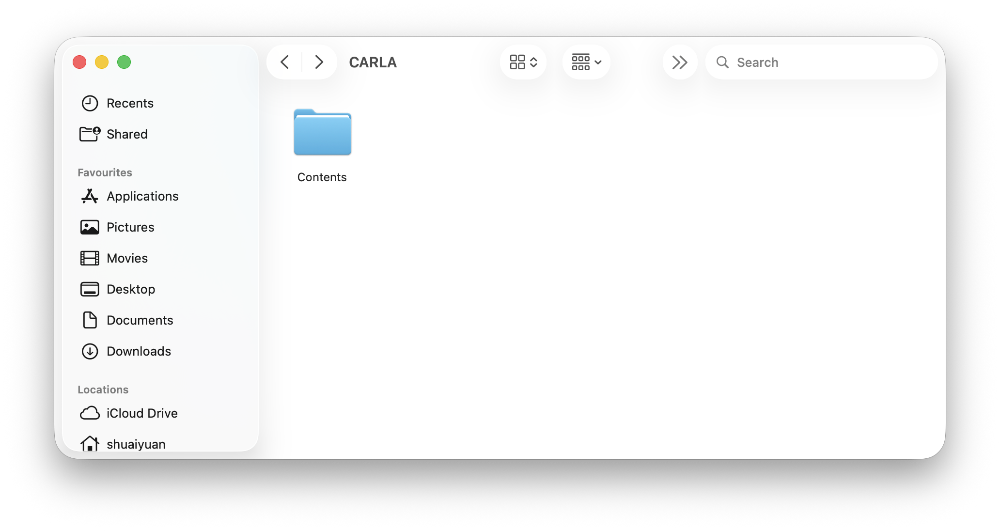
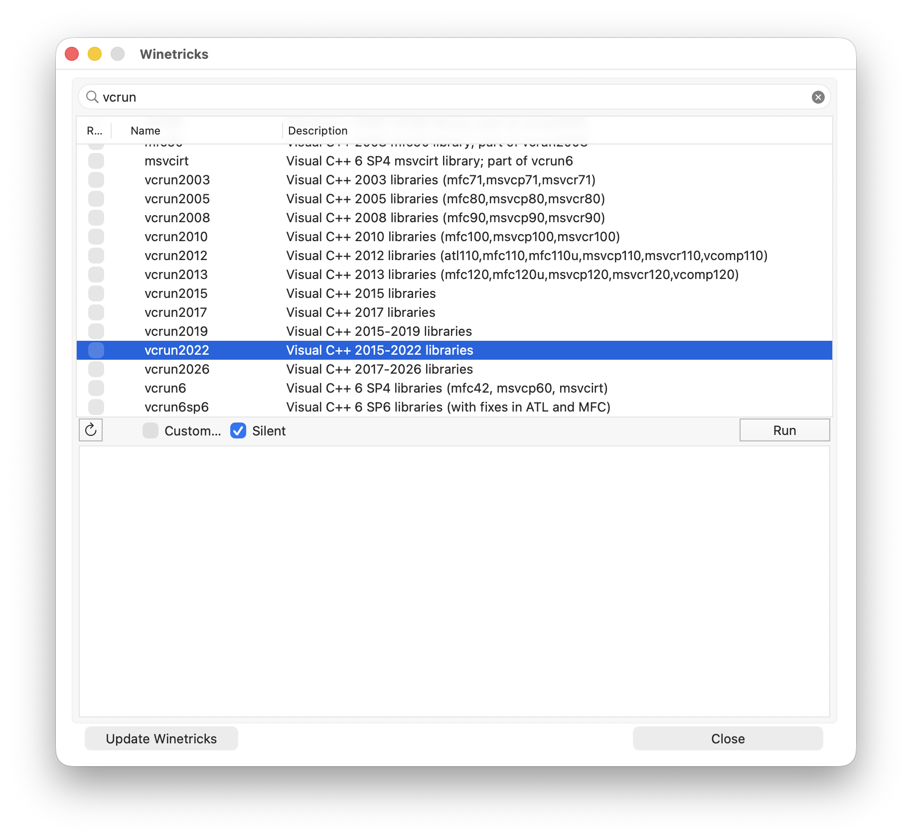
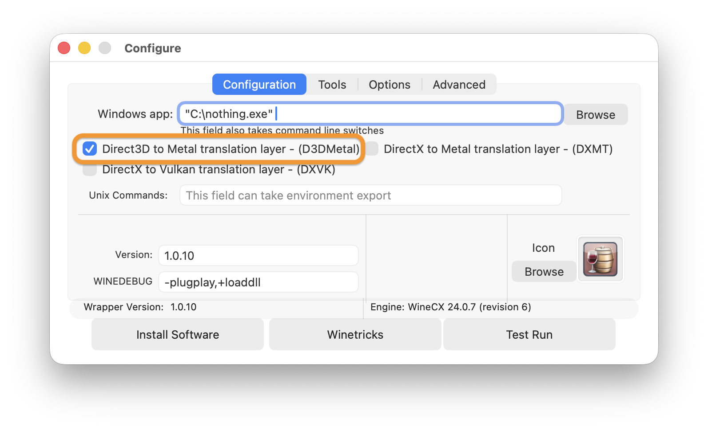
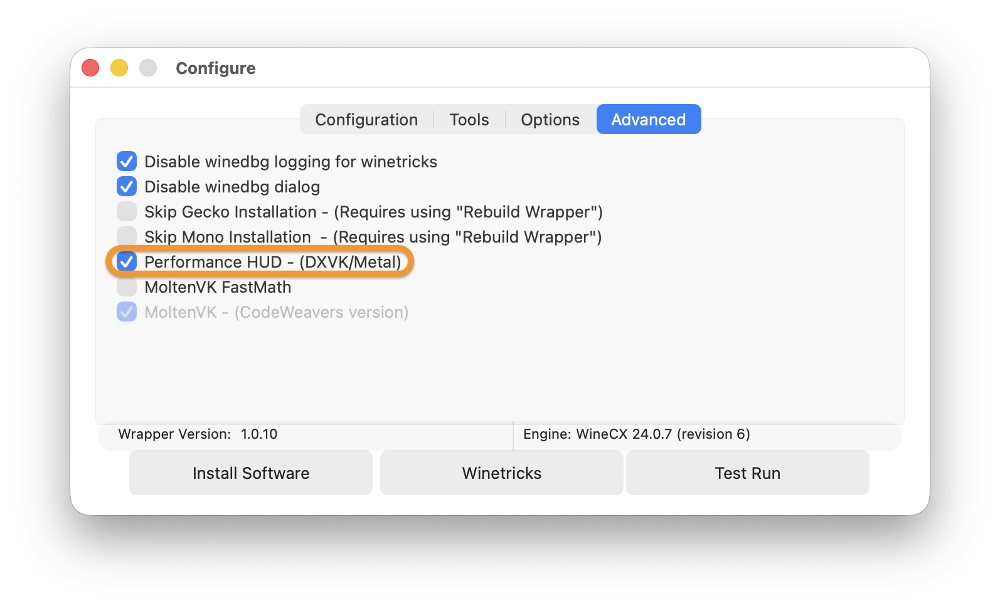
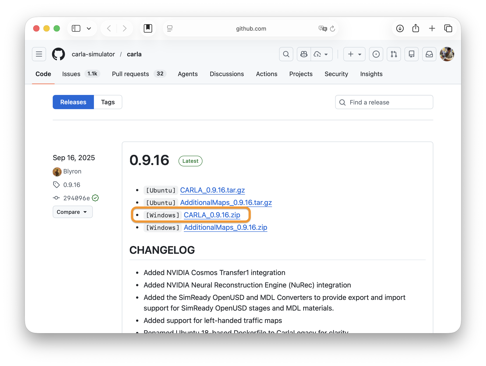
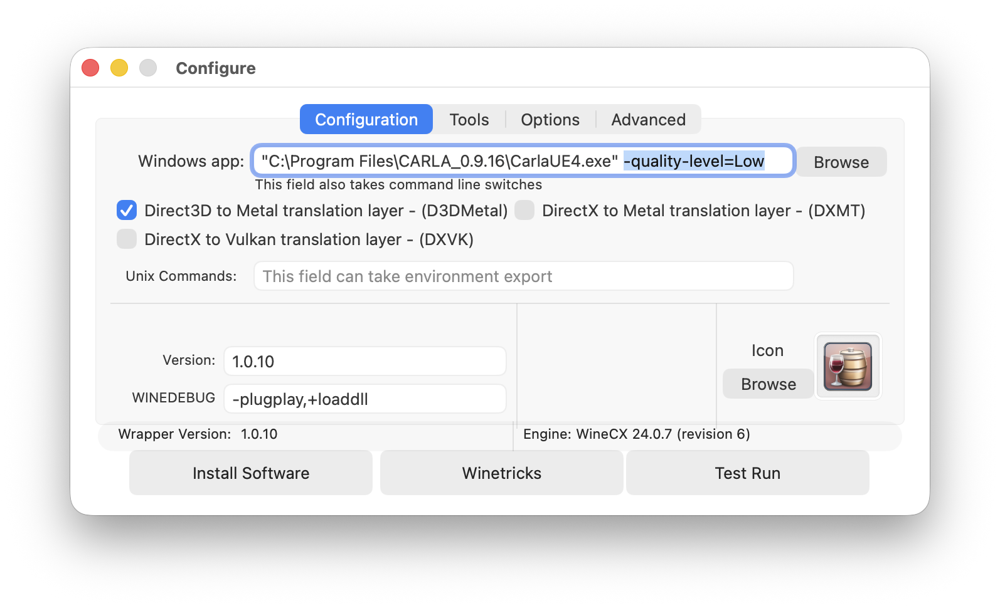
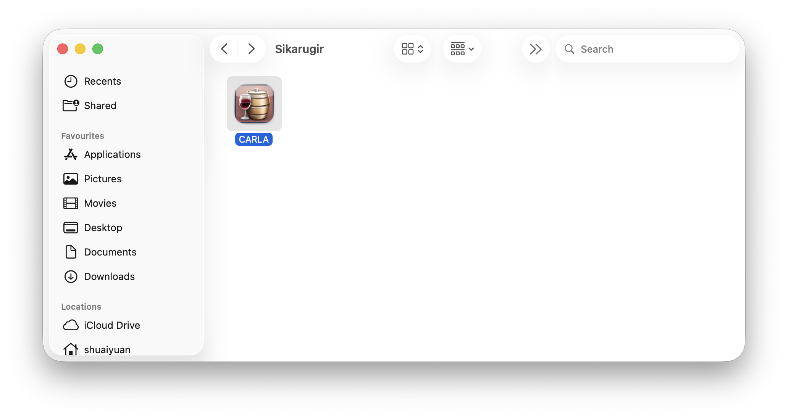

# Setup Carla on Mac (Apple Silicon)

Carla does not yet have native support for Mac (Apple Silicon), and Docker-based solutions are currently ineffective. This tutorial provides a workaround using **Wineskin (Wine)**.

### 1. Install Winery (Wineskin)

1. Download and install the latest version of Winery from [here](https://github.com/Sikarugir-App/Creator/releases).
   - Alternatively, if you have **Homebrew** installed, you can install it via the terminal:
   ```bash
   brew upgrade
   brew install --cask Sikarugir-App/sikarugir/sikarugir
   ```

2. **Rosetta 2** is required for Apple Silicon Macs. Install it by running:
   ```bash
   /usr/sbin/softwareupdate --install-rosetta --agree-to-license
   ```

### 2. Configure the Wrapper

3. Open the **Sikarugir Creator** app (usually found in `/Applications/Sikarugir Creator.app` or via Spotlight).
   


4. Install the latest engine and update the wrapper:
   - Click the **Change** button.
   - Select the engine: `WS12WineCX24.0.7_7`.
   


5. Create a new wrapper:
   - Click the **Create** button.
   - Name the new wrapper `Carla`.
   


### 3. Install Carla into the Wrapper

6. Open `CARLA.app` in Finder and right-click on it to select **Show Package Contents**.
   
   

7. A folder named `Contents` should appear.
   
   

8. Open `Contents/SharedSupport/Wineskin/Configure.app`. (Note: The path might vary slightly depending on the wrapper structure, but look for **Configure.app** or **Wineskin.app**).
   
   

9. Click the **Winetricks** button. Search for `vcrun` in the pop-up window, select `vcrun2022` only, and click **Run**.
   
   

10. After the installation is complete, close the **Winetricks** window.

11. Configure the performance and graphics settings:
    - In the **Configuration** tab, tick **Direct3D to Metal translation layer (D3DMetal)**.
    - In the **Advanced** tab, tick **Performance HUD (DXVK/Metal)**.
    
     

12. Download **Carla 0.9.16** from the [official releases](https://github.com/carla-simulator/carla/releases). 
    - **Note:** Version 0.9.16 is required for this project. 
    - Select `CARLA_0.9.16.zip` (Windows version), and extract it to a folder.
    
    

13. Click the **Install Software** button in the **Configure.app** mentioned earlier.

14. Click **Move a Folder Inside** and select the `CARLA_0.9.16` folder you just extracted.

15. In the **Choose Executable** pop-up, select `C:\Program Files\CARLA_0.9.16\CarlaUE4.exe`, then click **OK**.

16. In **Configure.app**, click the **Test Run** button to verify if Carla starts correctly.

17. (Optional) You can add flags to run Carla with specific settings, such as `-quality-level=Low` or `-RenderOffScreen`.
    
    

18. Once **Test Run** is successful, you can launch Carla directly by clicking the **Carla.app** icon in Finder.
    
    


### Acknowledgements

The method for running Carla on Apple Silicon Macs is based on the following GitHub Discussion:
https://github.com/carla-simulator/carla/discussions/9037

Many thanks to the contributors in that thread for sharing the solution.