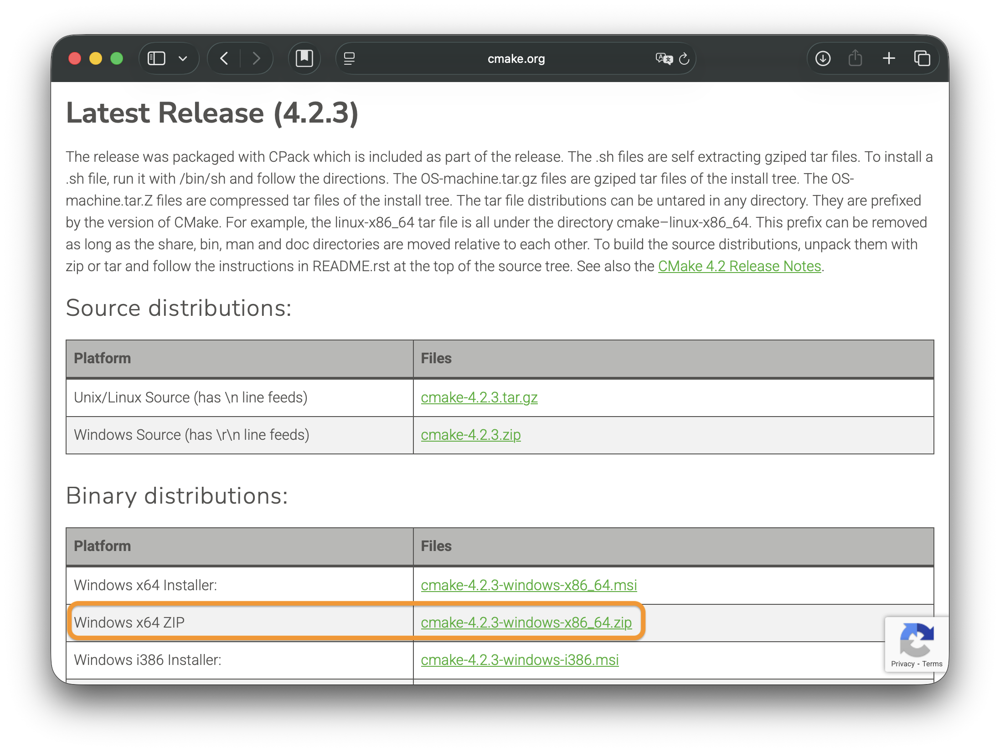

# Installing CMake in a Wineskin (Wine) Environment on macOS
This guide explains how to manually install and configure CMake within a macOS Wineskin wrapper (Windows 11 environment) to ensure it is accessible via the command line and usable for building projects.

## Prerequisites
- **Wineskin Winery** installed on macOS.
- A created **Wineskin Wrapper**

## Installation Steps
### 1. Download CMake Binary

> Do not download the Source Distribution. You need the pre-compiled binary for Windows.

- Go to the [CMake Download Page](https://cmake.org/download/#latest).

- Under **Binary distributions**, look for the **Windows x64 ZIP** package (e.g., `cmake-x.x.x-windows-x86_64.zip`).

- Download and extract the ZIP file 

### 2. Move Files to the Wrapper

- Locate your `.app` Wineskin wrapper in Finder.

- Right-click the app and select **Show Package Contents**.

- Navigate to: `drive_c/Program Files/`.

- Copy the extracted CMake folder into this directory.

  - Path Example: `.../drive_c/Program Files/cmake-x.x.x-windows-x86_64/`

### 3. Configure System Environment Variables

- Open `configure.app`, go to `Tools` tab, click on **Registry Editor (regedit)**.

- Navigate to the following key:
`HKEY_LOCAL_MACHINE\System\CurrentControlSet\Control\Session Manager\Environment`

- Edit the `Path` string, append the path to the CMake bin folder at the end: `...;C:\Program Files\cmake-x.x.x-windows-x86_64\bin`


## Verification
**Reopen** `configure.app`, click **Command Prompt (cmd)** button in the **Tools** tab.

Run the following command:
```
cmake --version
```

If the version information appears, CMake is successfully configured.
